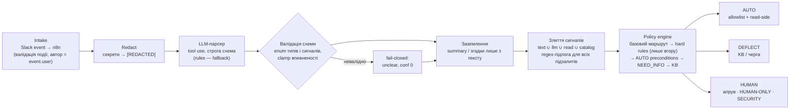
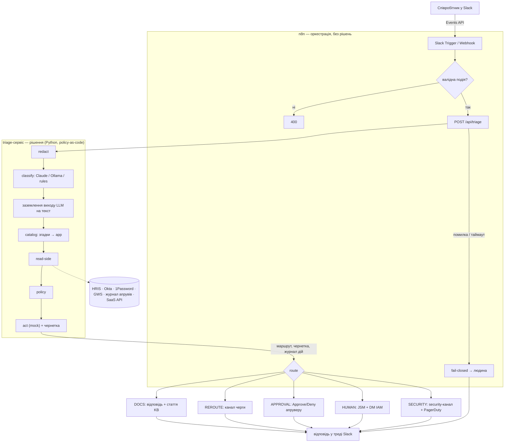
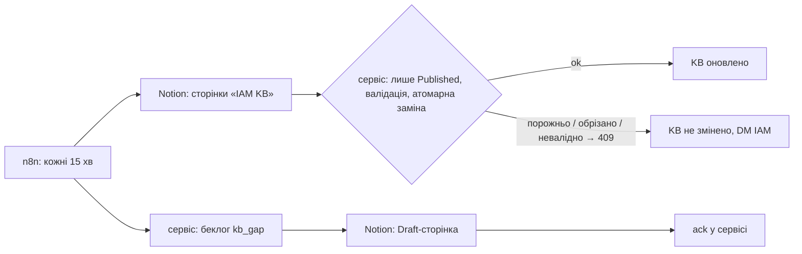
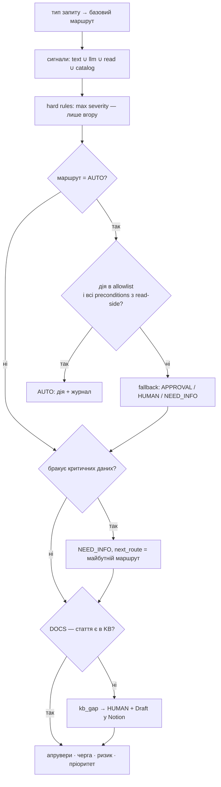

# Архітектура: AI-assisted triage запитів на доступи

> Як влаштовано, чому саме так, куди агент підключається і якими механізмами.
> Критика й обмеження — окремо в [`critique.md`](critique.md). Ключові рішення — у [`DECISIONS.md`](DECISIONS.md).

## 0. Коротко

Звернення зі Slack проходить через **n8n** (канал та інтеграції) у **triage-сервіс** (рішення). У сервісі:

1. секрети вирізаються **до** LLM;
2. **LLM лише розбирає текст у структуру** (тип, згадки систем, сигнали, чого бракує);
3. **детермінована policy** (`config/policy.yaml`) обирає маршрут на основі трьох незалежних джерел сигналів:
   - regex по тексту;
   - LLM;
   - факти з систем (read-side).

Правила можуть лише **підняти** маршрут, ніколи не знизити. Автоматична дія можлива лише з allowlist і лише тоді, коли передумови підтверджує система, а не текст звернення.

Головний принцип: **немає source of truth «хто-що-має-мати»**. Тому бот не намагається її вгадати. Розбіжність джерел — сигнал віддати людині.

### Вимоги й припущення

| | |
|---|---|
| **Функціональні** | для кожного звернення: тип, чого бракує, app / entitlement, чи потрібен апрув і чий, ризик-сигнали, маршрут + дія (чернетка, KB, ескалація) з поясненням |
| **Нефункціональні** | детермінізм (той самий розбір → той самий маршрут); fail-closed; аудит кожного рішення; секрети не виходять за межу redaction; вартість ≈ $0 |
| **Обмеження** | одна людина в команді; немає source of truth «хто-що-має-мати»; HRIS без SCIM; довгий хвіст non-SSO SaaS; лише моки для act-side; ~8 год на прототип |
| **Навантаження (припущення)** | сотні співробітників → десятки звернень на день; пікове навантаження не важливе, важливі латентність відповіді в Slack і якість рішення |

---

## 1. Схема

### Конвеєр рішення: intake → парсер → валідація → злиття сигналів → policy → зона



Зони й критерії входу — [`docs/zones.md`](zones.md). Чому LLM лише парсить — [ADR-0001](adr/0001-llm-parser-not-judge.md); чому невизначеність веде вгору — [ADR-0002](adr/0002-fail-closed.md); як проведено межі зон — [ADR-0003](adr/0003-zone-boundaries.md).

### Потік одного звернення



### Синк бази знань (Notion ⇄ сервіс)



**Межі довіри:**
- текст звернення недовірений, зокрема для LLM;
- вихід LLM недовірений, тому заземлюється на текст (ADR-010 / D10);
- факти read-side — довірені, але неповні;
- n8n — довірений і найпривілейованіший, тож захищається як IAM-адмінка (див. `critique.md` §3.2).

### Як policy приймає рішення (на один підзапит)



Кілька підзапитів в одному зверненні («доступ до VPN + інструкція») маршрутизуються окремо. Загальний маршрут — найсуворіший із них.

---

## 2. Спектр маршрутів і межі між ними

Сім маршрутів групуються в три зони ([`zones.md`](zones.md)): **AUTO** = AUTO_RESOLVE; **DEFLECT** = DOCS_REDIRECT + REROUTE; **HUMAN** = APPROVAL_GATED (людина вирішує, бот виконує) + HUMAN_REVIEW і SECURITY_ESCALATION (HUMAN-ONLY: людина вирішує і виконує). NEED_INFO — шлюз перед зоною.

| Severity | Маршрут | Хто діє | Коли | Приклад | Із 108 |
|---|---|---|---|---|---|
| 0 | **DOCS_REDIRECT** | ніхто: бот дає статтю | відповідь існує в KB **і** немає сигналів ризику | #7 ліміти Notion API, #93 MFA на Android | 16 |
| 1 | **AUTO_RESOLVE** | бот | дія з allowlist **і** передумови підтверджені read-side | #91 VPN (birthright), #104\* повторний інвайт | 1 |
| 1 | **REROUTE** | інша черга | не IAM (техніка, оплати, HR, ціни) | #51 монітор, #28 кредити | 10 |
| 2 | **NEED_INFO** | автор звернення | бракує системи / суб'єкта / списку людей / скоупу | #5 «ключ до однієї AI-моделі», #36 ключ «локалізаторам» без моделі | 21 |
| 3 | **APPROVAL_GATED** | апрувер → бот | видача доступу, ліміти, ключі | #69\* повернення Tableau після mover, #16 квота BigQuery | 15 |
| 4 | **HUMAN_REVIEW** | IAM-інженер | ризик, конфлікт джерел, critical-tier, привілеї | #46 «все що у ліда», #75 обхід HRIS, #92 offboarding, #17 ліміти «5 людям» (від імені інших) | 42 |
| 5 | **SECURITY_ESCALATION** | security, P1 | секрет злитий, підозріла автентифікація, вразливість | #32, #18, #85, #42\* (Tor-входи в System Log) | 3 |

Колонка «Із 108» — прогін від імені «типового співробітника» (`tests/golden_routes.json`). \* — маршрут для синтетичного автора з демо-вибірки (`demo/sample.yaml`). Від «типового співробітника» той самий текст дає інший маршрут: #104 → APPROVAL (у нього немає погодженого інвайту), #69 і #42 → NEED_INFO (у System Log немає подій). Це і є роль read-side: рішення залежить від фактів про конкретну людину, а не лише від тексту.

### Де проходять межі й чому

| Межа | Правило | Обґрунтування |
|---|---|---|
| **DOCS ↔ HUMAN** | DOCS лише якщо стаття реально існує в KB. Інакше `kb_gap` → людина + чернетка статті в Notion | бот не пише інструкцій «з голови»; галюцинована інструкція з налаштування доступу гірша за відповідь людини через годину |
| **AUTO ↔ APPROVAL** | AUTO = дія з allowlist **×** низький ризик **×** автор = суб'єкт **×** активний у HRIS **×** одна система (entitlement) на підзапит **×** факт із системи | «лід в курсі» в тексті ≠ апрув (#5). Апрув — лише запис у журналі апрувів, прив'язаний до людини й app (GAP-3) |
| **NEED_INFO перед APPROVAL** | бракує даних → спершу питаємо; `next_route` зберігає, куди піде далі | апрув «наосліп» — апрувер погоджує щось неконкретне → over-granting |
| **APPROVAL ↔ HUMAN** | привілеї, широкий скоуп, «як у X», critical-tier, конфлікт джерел, апрувер недоступний за HRIS | там, де помилку не відкотити або де потрібне рішення, а не підтвердження |
| **→ SECURITY** | секрети, вразливості, підозріла автентифікація — **навіть якщо «не до IAM»** | #85 пентест — не IAM-тікет, але загубити його не можна |
| **Діагностика ≠ вирішено** | read-only діагностика без знахідок → NEED_INFO (скрін, час), а не «усе ок» | знайдено як помилку AI (`ai-mistakes.md` #4) |

### Пороги

| Поріг | Значення | Звідки | Чесно |
|---|---|---|---|
| `llm_min_confidence` | 0.7 | нижче → HUMAN | експертне, не відкаліброване; впевненість, яку LLM повідомляє про себе, ненадійна, тож це не основний захист |
| `max_subjects_auto` / `single_entitlement` | 1 | AUTO лише для одного суб'єкта й однієї системи | щоб LLM не обирала, що видати |
| `resend_max_age_days` | 30 | повторний інвайт за старим апрувом | після 30 днів людина могла змінити роль |
| `approval_ttl_hours` | 72 | апрув на ще не виконану дію | act-side апрувів поза прототипом |
| `temp_access_default_days` | 30 | строк неперманентних доступів | для APPROVAL-плану |
| KB sync `MIN_SHARE` | 0.5 | новий набір статей ≥ 50% поточного | інакше відмова: збій Notion не вимикає DOCS тихо |

Калібрування цих порогів — перший пункт «до проду» в `critique.md` §4: розмітка від людини + shadow-режим.

---

## 3. Куди агент підключається: read-side і act-side

### 3.1 Основні системи

| Система | Read-side: механізм → сигнал | Наскільки надійний | Act-side | У прототипі |
|---|---|---|---|---|
| **Slack** | `event.user` з підписаної події; `users.info` → `is_stranger`, `team_id` (Slack Connect) | хто написав — так; хто це в HR-сенсі — ні | `chat.postMessage` у тред; Block Kit Approve/Deny; DM | Webhook у n8n з форматом Events API |
| **HRIS** (без SCIM) | REST API, **polling + diff** по `updated_at`: статус, менеджер, відділ, відпустки, дати найму/звільнення | джерело правди для «людина існує / активна», але з затримкою polling; дати в різних TZ → нормалізувати в UTC | **жодних дій** — лише читання | мок |
| **Okta** | Users/Groups/AppLinks API; **System Log** (`/api/v1/logs`: outcome, reason, IP, geo) — найкращий сигнал для діагностики входу; Event Hooks (push) | SSO-призначення — так; non-SSO SaaS — ні | OAuth service app, scope на керування групами + custom admin role на resource set **лише з allowlist-груп** (TODO(verify)) | мок; `#42` — Tor-входи → SECURITY, `#69` — group rule після mover → APPROVAL |
| **1Password** | Events API (signinattempts, itemusages, auditevents); SCIM bridge (users/groups) | хто має доступ до vault — так; чи секрет уже скопійовано — ні | **жодних авто-дій** над vault / items | мок; offboarding-план показує, які секрети ротувати |
| **Google Workspace** | Admin SDK Directory (users, groups); Reports API (login, OAuth-токени сторонніх апок) | Directory — так; Reports — години затримки | Directory через service account з domain-wide delegation (мінімальні scopes); Data Transfer при offboarding | мок |
| **Журнал апрувів** | запис кнопки Slack: approver_id, timestamp, subject, app, role | єдиний прийнятний доказ апруву | — | мок (`mocks/approvals.json`) |
| **Notion** | DB «IAM KB»: статті (`Status = Published`) | контент — так; актуальність — за власником статті | створення Draft-сторінок для `kb_gap` | **жива інтеграція** через n8n |
| **LLM** | — | недовірений вихід | — | Claude Haiku (tool use, строга схема) · Ollama (локально) · rules (fallback) |

### 3.2 Довгий хвіст (33 застосунки в `config/app_catalog.yaml`)

| | К-сть |
|---|---|
| SSO через Okta / Google / без SSO | 20 / 4 / 9 |
| Provisioning: Okta-група / SCIM / API застосунку / вручну | 7 / 7 / 9 / 10 |
| Risk tier: low / medium / high / critical | 6 / 12 / 12 / 3 |

Для кожного застосунку каталог описує: аліаси, механізм read/act, власника, тип апруву, ризик, чи платний і практичні нюанси, які змінюють рішення. Найважливіші:

| Застосунок | Нюанс, що змінює маршрут |
|---|---|
| App Store Connect | користувача можна обмежити конкретними apps, а **API-ключ команди — ні** (TODO(verify)). «Менеджерський ключ до однієї app» (#6, #34) може виявитись ключем до всіх. Спільний Apple ID для TestFlight (#66) = shared credential |
| Meta Business Manager | користувачі прив'язані до **особистих** FB-акаунтів. Відновлення FB-входу (#24) — не IAM; доступ «з усіма фін показниками» (#57) — окремий рівень |
| Tableau | доступ зникає через Okta group rule після зміни відділу (#69). «Хочу read-only» (#71) = дешевша роль, а не лише менше прав |
| BigQuery | «ліміти» — це custom quotas на проєкт / користувача, а не IAM (#16, #35). Підняти = рішення по витратах |
| Gemini / Anthropic API | ключ без restrictions = білінг на весь проєкт. Ключ лише в 1Password-vault команди, зі spend limit, ніколи в Slack |
| Market-intel (VDI) | усередині спільні акаунти тулів: немає персонального аудиту, відкликання = зміна пароля для всіх (#21, #50, #63) |
| n8n | доступ до інстансу ≈ доступ до кредів усіх інтеграцій (#76: «просто інвайт» = risk high) |
| Платіжна платформа | диспути = PCI-скоуп (#87: «на всіх спейсах» = broad scope) → critical |
| Claude / OpenAI org | seat-апгрейди й extra usage — гроші, не доступ: апрув бюджет-власника (#17, #67, #86). MCP-конектори — security review (#12, #40, #59) |

Звідси принцип: **маппінг на app детермінований**. LLM повертає лише сирі згадки («табло», «клод-код»), а `catalog.py` знаходить найдовший аліас. Немає збігу → `unknown_app` → NEED_INFO. Таких 15 зі 108, і це правильно: «один креатив-тул» не можна вгадувати.

### 3.3 Act-side у прототипі

Усі дії — JSONL-журнал `demo/actions*.log` з `dry_run: true`. Кожен запис містить:
- який виклик API був би зроблений;
- які передумови перевірено;
- idempotency key.

| Тип запису | Коли |
|---|---|
| `action` | AUTO або read-only діагностика |
| `approval_request` | APPROVAL, або NEED_INFO з `next_route = APPROVAL` (`blocked_on_info`) |
| `clarification` | NEED_INFO |
| `reroute` | REROUTE |
| `escalation` | HUMAN / SECURITY; для offboarding — з **dry-run планом по всіх системах** для людини |

---

## 4. Стек і чому саме такий

| Роль | Рекомендовано | Обрав | Чому |
|---|---|---|---|
| Оркестратор | n8n / Make | **n8n** (self-hosted, Docker) + **Python-сервіс рішень** | n8n — канал і інтеграції (Slack, Notion, ретраї, креди). Рішення — у коді, бо розгалужену policy у вузлах n8n неможливо нормально тестувати й рев'юїти. 347 тестів ганяються за 4 с; той самий код працює з CLI, стенду й n8n |
| Канал | Slack | **Slack** (Events API → n8n) | автор = `event.user` з підписаної події; кнопки апруву — Block Kit |
| KB | Notion | **Notion** (жива база «IAM KB») | синк кожні 15 хв у сервіс (лише Published, атомарно); `kb_gap` → Draft. `config/kb.yaml` — фікстура для тестів і офлайн-запуску |
| Класифікація | LLM клас Haiku / Sonnet | **Claude Haiku 4.5** (tool use, строга схема, temperature 0, кеш) · **Ollama** (локальна модель на власному GPU) · **rules** (fallback і baseline) | Haiku: дешево (~$0.4 за прогін 124 звернень) і достатньо для парсингу, бо рішення не на LLM. Ollama: $0 і персональні дані не виходять із мережі. Rules: працює без мережі, і на нього деградує fail-closed |

**Альтернативи, які відкинув:**
- **Уся логіка в n8n.** Не тестується, не рев'юїться diff-ом, складні гілки нечитабельні.
- **LLM обирає маршрут.** Наївний промпт v1 у `ai-artifacts/prompts/`: недетермінований, піддається injection, нема чого аудитувати.
- **Окремий векторний пошук по KB.** Для 21 статті keyword-матчинг детермінований і пояснюваний; семантичний пошук — коли статей сотні.

---

## 5. Безпекова модель (стисло)

Дев'ять золотих правил — у `CLAUDE.md`. Вони перевіряються тестами, а не лише задекларовані:

| Правило | Як перевірено |
|---|---|
| LLM — парсер; маршрут не нижче regex-підлоги | hypothesis: 300 довільних виходів LLM на реальних текстах |
| Лише вгору | metamorphic: `f(звернення + «асап» / «адмінку» / «ключ злитий») ≥ f(звернення)` для всіх 108 |
| AUTO лише з allowlist і з read-side | тест: жодна дія поза allowlist у журналі; неактивний у HRIS → без AUTO |
| Секрети до LLM і логів | кожен патерн × (текст, тред) → секрету немає ні в LLM-вході, ні в чернетці, ні в журналі, ні у фактах |
| Fail-closed | недоступність LLM / битий JSON → ≥ HUMAN, без дій |
| Нейтральні відповіді | у чернетках немає внутрішніх id сигналів і «соц. інженерії» |
| Дрейф | golden snapshot 108 маршрутів: будь-яка зміна — лише свідомо |

Залишкові ризики — `critique.md` §3.

---

## 6. Запуск і розвиток

```bash
pip install -r requirements.txt && pytest -q          # 347 тестів
python run_demo.py --all                              # демо 16 кейсів + розподіл по 108
python tools/stand.py                                 # веб-стенд :8765
colima start && docker compose up -d --build          # n8n :5678 + triage-сервіс
```

Як колезі додати новий застосунок або правило — `CLAUDE.md` → «Робочий процес»:

1. правка `config/*.yaml`;
2. `pytest`;
3. `run_demo.py --all`;
4. переглянути diff маршрутів (`git diff demo/`, golden snapshot).

---

## 7. Модель даних

Один розбір звернення — це **рішення з поясненням**. Сервіс повертає його з `POST /api/triage`, і воно ж іде в журнал.

| Сутність | Де в коді | Ключові поля | Хто заповнює |
|---|---|---|---|
| **Request** | вхід `pipeline.run_one` | `text`, `thread`, `requester_slack` (= `event.user`), `received_at` | Slack → n8n |
| **Classification / SubRequest** | `classify.py` | `type` (enum 21), `app_mentions` (дослівно), `subject` (self / other / multiple / unknown), `missing_info`, `signals` (enum 20), `confidence` | LLM (недовірено) → валідація |
| **Signal** | `signals.py` | `name`, `origin` (text / llm / read / catalog / classifier / kb), `evidence` | regex, LLM, read-side, каталог |
| **ReadContext / Fact** | `readside.py` | `requester_email`, `requester_active`, `manager`, `manager_available`, `preconditions{}`, `facts[]` (source, mechanism, statement), `dry_run_plan[]` | HRIS, Okta, 1Password, GWS, журнал апрувів |
| **Decision** | `policy.py` | `route`, `next_route`, `action`, `action_done`, `approvers[]`, `reasons[]` (signal, origin, evidence, min_route, reason), `risk_score`, `priority`, `queue`, `kb[]`, `questions[]` | policy engine |
| **ActionLog entry** | `act.py` | `kind` (action / approval_request / clarification / reroute / escalation), `would_call`, `preconditions`, `idempotency_key`, `dry_run: true` | act (mock) |

Приклад (скорочено, #46 «дайте все, що було у ліда, лід у відпустці»):

```json
{
  "route": "HUMAN_REVIEW",
  "decisions": [{
    "type": "access_request", "primary_app": "google_workspace", "subject": "self",
    "signals": [
      {"name": "mirror_access", "origin": "text", "evidence": "regex 'що у (ліда|нього|неї|колеги) було' → «що у ліда було»"},
      {"name": "broad_scope", "origin": "text", "evidence": "regex 'все видати' → «все видати»"},
      {"name": "urgency", "origin": "text", "evidence": "regex 'асап' → «асап»"},
      {"name": "approver_unavailable", "origin": "read", "evidence": "менеджер requester'а у відпустці за HRIS, делегата немає"}
    ],
    "reasons": [
      {"signal": "type:access_request", "min_route": "APPROVAL_GATED"},
      {"signal": "mirror_access", "min_route": "HUMAN_REVIEW", "reason": "'Дай як у X' — копіювання прав = over-granting"},
      {"signal": "broad_scope", "min_route": "HUMAN_REVIEW"},
      {"signal": "approver_unavailable", "min_route": "HUMAN_REVIEW"}
    ],
    "approvers": ["manager:… (НЕДОСТУПНИЙ)", "budget-owner"], "priority": "P2", "action": null
  }],
  "draft": "Передав запит IAM-інженеру. Доступи видаємо під конкретну задачу, а не «як у колеги» — так менше зайвих прав. …",
  "actions": [{"kind": "escalation", "queue": "iam-review", "priority": "P2", "dry_run": true}]
}
```

**Контракти сервісу:**

| Endpoint | Хто кличе | Авторизація | Що робить |
|---|---|---|---|
| `POST /api/triage` | n8n, стенд | мережа compose / localhost | розбір + рішення; класифікатор обирає сервіс (`CLASSIFIER_MODE`), а не клієнт |
| `POST /api/kb/sync` | n8n (KB sync) | `X-KB-Sync-Token` | атомарна заміна KB; 409 на порожній / обрізаний / невалідний набір |
| `GET /api/kb/gaps`, `POST /api/kb/gaps/ack` | n8n (KB sync) | `X-KB-Sync-Token` | беклог `kb_gap` (лише відредагований текст) |

## 8. Точки розширення

| Що додати | Де | Потрібен код? | Що перевірити |
|---|---|---|---|
| **Новий SaaS / entitlement** | запис у `config/app_catalog.yaml`: аліаси, `sso`, `provisioning`, `risk_tier`, `approval`, `owner`, `cost`, `kb`, `nuance` | **ні** | `pytest` (цілісність каталогу: унікальні аліаси, KB-посилання існують) |
| Нова birthright-група для AUTO | каталог (`birthright`, `okta_group`) + allowlist бота в Okta | ні | тест: група бота ∈ low-risk birthright |
| Нове правило / зміна межі | `config/policy.yaml → hard_rules` (сигнал → `min_route`) | ні, якщо сигнал уже є | golden snapshot: diff маршрутів має бути свідомим |
| Новий сигнал (напр. `prod_access`) | regex у `signals.py` + рядок у `hard_rules` + (опц.) enum LLM | так, мінімально | тест «є продюсер для кожного правила» + тест на клас |
| Нова стаття KB | Notion «IAM KB», `Status = Published` | ні | підтягнеться синком за 15 хв |
| Новий тип звернення | `type_base_route` у `policy.yaml` + `TYPE_REASON` + промпт | так | тест «у кожного типу є маршрут і пояснення» |
| Нове джерело read-side | функція в `readside.py` з тим самим `ReadContext` (`Fact` із source + mechanism) | так | моки + тест передумов |
| Інша LLM | `CLASSIFIER_MODE` (`llm` / `ollama`) | ні | той самий валідатор і тести |

## 9. Масштаб, надійність, що переглянути

- **Латентність.** Haiku відповідає за ~секунди, локальна модель — за кілька секунд, а Slack чекає ack приблизно 3 с (TODO(verify)). Тому в проді: ack одразу, обробка асинхронно, дедуп за `event_id`. У прототипі n8n відповідає синхронно.
- **Повтори й вартість.** Відповіді LLM кешуються за хешем (модель + версія промпта + текст). Повторний прогін і `replay` безкоштовні.
- **Ідемпотентність.** Кожна дія має `idempotency_key`; повтор події не дублює дію.
- **Моніторинг (до проду):**
  - розподіл маршрутів (дрейф);
  - частка `rules-fallback` і `low_confidence`;
  - **override rate** (людина змінила маршрут бота);
  - дії бота поза allowlist (має бути 0).
- **Що переглянути з ростом:**
  - keyword-матчинг KB → семантичний пошук, коли статей сотні;
  - стан треду (NEED_INFO → перезапуск triage);
  - дедуп звернень за змістом;
  - зберігання журналу рішень у SIEM замість JSONL;
  - окремий ingress-сервіс для redaction до n8n (`critique.md` §3.2).
- **Заплановано (фаза 5, `zones.md` §6):** `on_behalf` (видача) і `financial_data` → HUMAN_REVIEW; нові сигнали `prod_access`, `sod_conflict`; GitHub, AWS, Figma, Amplitude у каталозі.

