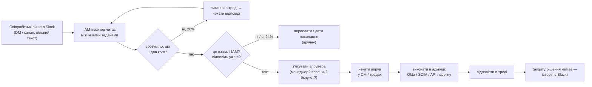

# Поточний стан: потік звернень, який тримає одна людина

> Фаза 1 (`operations:process-optimization`). Джерела: 108 знеособлених звернень (`data/requests.csv`), розбір
> rules-класифікатором (118 підзапитів), каталог 33 застосунків (`config/app_catalog.yaml`), текст завдання.
> **Таймінгів у датасеті немає.** Усе про час нижче — гіпотези, які треба виміряти до запуску (§6).

## 1. Як це працює сьогодні (реконструкція)

Кожен крок робить **та сама людина**: читає, уточнює, шукає апрувера, виконує, відповідає. Черги, пріоритетів і журналу рішень немає. Пріоритет визначає той, хто голосніше пише «асап».

## 2. Таксономія звернень

Rules-класифікатор грубий, тож цифри орієнтовні (±кілька звернень). Для калібрування потрібна розмітка людиною (§6).

| Клас | Підзапитів | Типи в `policy.yaml` | Приклади (№) |
|---|---|---|---|
| Видача доступу / інвайти / онбординг | 30 | `access_request`, `invite_resend`, `onboarding` | #30 GrowthBook, #46 «як у ліда», #75 нова людина, #104 інвайт |
| Ліміти, ліцензії, оплата | 21 | `limits_quota`, `license_request`, `license_issue`, `billing_finance` | #17 ліміти Claude 5 людям, #28 кредити, #71 дешевший тариф |
| Діагностика входу / «зник доступ» | 18 | `login_diagnostic`, `credential_reset` | #15 Claude Code релогін, #42 «по вечорах», #69 Tableau, #95 скинути пароль |
| Консультації (відповідь існує) | 16 | `how_to`, `policy_question` | #7 ліміти Notion API, #93 MFA на Android, #106 що таке Okta |
| API-ключі та секрети | 11 | `api_key_request`, `secret_incident` | #5 / #36 / #62 ключ до AI-моделі, #32 скомпрометований ключ |
| Не IAM / проєктна робота | 10 | `not_iam`, `project_work` | #51 монітор, #44 особисте, #49 міграція домену + DMARC |
| Інтеграції / зміни безпекових політик | 5 | `integration_connector`, `security_policy_change` | #12 always-allow MCP, #40 конектор Make |
| Дані про людей (PII) | 4 | `usage_report`, `data_export` | #26 телефони з Business Manager, #98 статус звільнення |
| Офбординг | 2 | `offboarding` | #92 «заблокуйте все», #41 забрати підписку |
| Неясно | 1 | `unclear` | |
| **Разом** | **118** | 21 тип | 9 звернень містять кілька запитів (#8, #25, #29, #49, #52, #71, #77, #91, #97) |

**Домени:**
- **AI-тули — найбільший окремий домен:** 28 зі 108 (26%). Це Claude-організація (16 згадок), API-ключі до моделей, ліміти й extra usage, MCP-конектори. Такий потік з'явився нещодавно, і стандартних процедур для нього, найімовірніше, ще немає.
- **Довгий хвіст:** 27 звернень не називають систему або називають ту, якої немає в каталозі («одна креатив-тула», «композит»).
- **Механізми видачі** для згаданих систем: SCIM — 36, API застосунку — 23, Okta-група — 17, **вручну — 12**.

## 3. Втрати (Lean-аналіз)

| Тип втрат | Де видно в датасеті | Масштаб |
|---|---|---|
| **Очікування: уточнення** | бракує системи / суб'єкта / списку людей / скоупу: «список дам» (#17), «деталі в треді» (#18, #92), «одна з моделей» (#5) | **28 / 108 (26%)** звернень потребують хоча б одного кола «питання → відповідь» до початку роботи |
| **Очікування: апрув** | апрувер не вказаний; «лід в курсі» (#5) — не апрув; менеджер у відпустці (#46) | кожен запит на доступ, ліміт чи ключ — 51 підзапит класів «доступ», «ліміти», «ключі» |
| **Переривання не за адресою** | не IAM (#51, #79), відповідь уже існує (#93, #106, #107) | **26 / 108 (24%)** — переслати або дати посилання, але людину все одно перериває |
| **Ручна робота** | non-SSO і ручний provisioning: Meta BM, App Store Connect, Sensor Tower, платіжка | 12 згадок систем з ручною видачею; 9 застосунків без SSO |
| **Повтори** | однакові запити від різних людей / в різний час (див. нижче) | ≥6 кластерів, 3–7 звернень у кожному |
| **Змішані запити** | «доступ + не працює + поповніть баланс» в одному повідомленні (#52, #77) | 9 звернень — треба розбирати вручну |
| **Перевиконання під тиском** | «терміново», «асап», «до 12» — разом зі скиданням пароля (#95) і обходом HRIS (#75) | 9 звернень із сигналом терміновості; саме тут найвищий ризик соц. інженерії |
| **Немає сліду** | рішення й апруви — у DM | неможливо відповісти «чому в людини є цей доступ» |

**Кластери повторів** — кандидати на першу KB-статтю або стандартну процедуру:

| Кластер | Звернення |
|---|---|
| Ліміти / seat-и / extra usage AI-тулів | #17, #31, #55, #67, #86, #90, #97 |
| API-ключ до AI-моделі | #5, #36, #54, #62, #83 |
| Market-intel тули / віддалене середовище | #21, #50, #63, #101 |
| Ключі / доступ до store-консолей | #6, #22, #34, #38 |
| Tableau: доступ зник або не пускає | #69, #71, #82, #84 |
| Тула транскрибації | #10, #13 |

## 4. Bus factor = 1

| Що зосереджено в одній голові | Наслідок |
|---|---|
| хто власник якої системи, хто апрувить | відпустка або хвороба = потік зупиняється |
| які застосунки без SSO, де спільні креди (#14, #56, #64) | при офбордингу частину доступів забудуть: поза Okta їх ніхто не бачить |
| «чому в людини є цей доступ» | аудит і відкликання — неможливі або вручну |
| рішення приймає й виконує та сама людина | **немає SoD**: немає другої пари очей на привілейованих доступах і, теоретично, на власних |
| терміновість вирішує пріоритет | найризиковіші запити (термінові скидання, обхід HRIS) обробляються найшвидше й з найменшою перевіркою |

## 5. Цільовий стан і очікуваний ефект

Що змінюється — у [`docs/zones.md`](../zones.md) і [`docs/architecture.md`](../architecture.md). Коротко:

| Втрата | Що робить система | Ефект (на 108 зверненнях, rules-прогін) |
|---|---|---|
| Переривання не за адресою | DEFLECT: стаття з KB або переадресація в чергу | 26 звернень закриваються без людини |
| Очікування уточнень | NEED_INFO: бот ставить конкретні питання **до** людини й апрувера | 21 звернення доходить до людини вже повним; на HUMAN-маршруті бот теж одразу ставить питання |
| Пошук апрувера | апрувер — з каталогу (власник) і HRIS (менеджер, відпустка) | APPROVAL: 15 — апрувер відомий заздалегідь |
| Немає сліду | журнал рішень з причинами й фактами | 100% звернень |
| Bus factor | політика й каталог — у репо, а не в голові | роль людини: з виконавця на власника policy (`docs/process/raci.md`) |
| Немає SoD | привілейоване, фінанси, PII, офбординг — лише людина, апрув окремо від виконання | HUMAN + SECURITY: 45 |

Чесно: **людині лишається ~половина звернень** (HUMAN 42 + APPROVAL 15 + SECURITY 3 = 60 зі 108, після розширення HUMAN-ONLY). Зміна не в тому, що «людина не потрібна», а в тому, що вона отримує повне звернення з фактами, а не сирий DM.

## 6. Що виміряти до запуску (baseline)

Без baseline неможливо показати, що стало краще. Цей урок я виніс із попередньої реальної інтеграції: див. `docs/real-integrations.md`.

| Метрика | Як зняти | Навіщо |
|---|---|---|
| Час до першої відповіді / до вирішення, медіана | 2 тижні ручного логування або експорт тредів | головна метрика для людини |
| Частка звернень з колом уточнень | розмітка тих самих тредів | перевірити гіпотезу «26%» |
| Розподіл за класами (розмітка людиною) | 200 реальних звернень | калібрування класифікатора й порогів |
| Частка переривань не за адресою | та сама розмітка | перевірити «24%» |

**План впровадження:**
1. baseline (2 тижні);
2. shadow (бот пише лише внутрішню нотатку, 2–4 тижні) — міряємо override rate;
3. DEFLECT і NEED_INFO вмикаються першими, бо низький ризик;
4. AUTO — по одній дії, з kill switch.
